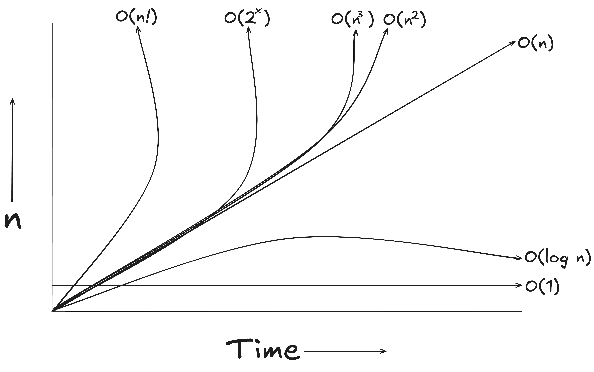

# ⏱️ Space & Time Complexity in JavaScript (Bangla)

A beginner-friendly, in-depth guide to **Time Complexity** and **Space Complexity** explained in **Bangla**, with practical examples and visual learning support.

---

## 📘 What’s Inside?

- ✅ Time Complexity Explained (Bangla)
- ✅ Space Complexity Explained (Bangla)
- ✅ Real-world coding examples (in JavaScript)
- ✅ Common Big-O Notations (O(1), O(n), O(n²), etc.)
- ✅ Best Practices to Avoid TLE (Time Limit Exceeded)
- ✅ Visual and Intuitive Notes (Bangla)

---

## 📑 Topic-wise Index

| Lesson No. | Topic                                   | Description                                          |
| ---------- | --------------------------------------- | ---------------------------------------------------- |
| 1️⃣         | What is Time Complexity?                | Basic concept and importance of time complexity      |
| 2️⃣         | Big-O Notation (O(1), O(n), O(n²), ...) | Types of complexities with real-life examples        |
| 3️⃣         | What is TLE (Time Limit Exceeded)?      | Why TLE happens and how to avoid it                  |
| 4️⃣         | Time Complexity Code Examples           | Code-based explanation of time complexity            |
| 5️⃣         | What is Space Complexity?               | Understanding memory usage and efficiency            |
| 6️⃣         | Constant vs Linear Space (O(1) vs O(n)) | When space usage is constant or linear with examples |
| 7️⃣         | Space Complexity Code Examples          | Examples with explanation of space complexity        |

---

## 📑 Time Complexity Graph

---

## 

## 🧠 Target Audience

This repository is designed for:

- 🆕 Beginners who want to master algorithm efficiency.
- 📚 Bangla-speaking learners who struggle with English-heavy DSA resources.
- 👨‍💻 JavaScript learners focusing on problem-solving and optimization.

---

## 🛠 Tech Used

- Language: **JavaScript**
- Explanation: **Bangla** (বাংলা ভাষায় ব্যাখ্যা)
- Style: Beginner-friendly and example-driven

---

## 💡 Why Learn Time & Space Complexity?

> "ভালো কোড লেখা শেখার প্রথম ধাপ হচ্ছে efficient কোড লেখা শেখা।"

Learning time and space complexity will help you:

- Avoid Time Limit Exceeded (TLE) errors
- Write optimized, real-world ready solutions
- Prepare for coding interviews

---

## ✍️ Author

[Hamim Ibn Hannan](https://hamimibnhannan.netlify.app/)

---

## 🌟 Star this repo if it helps you!
